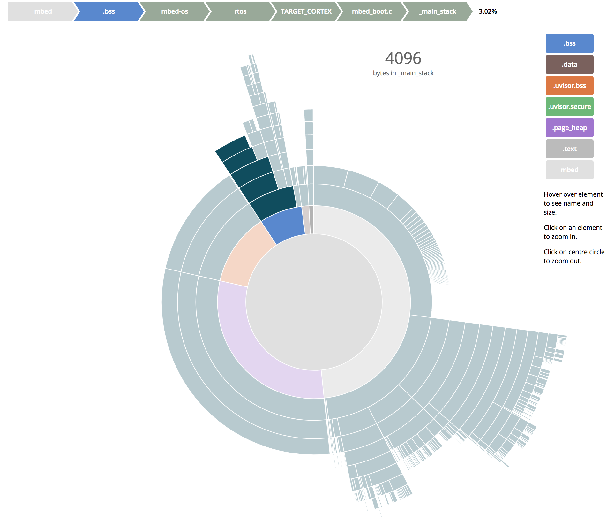

# d3.js based ELF Linker Statistics
This repository is used to generate interactive linker statistics. Please have a look at our [interactive example](https://armmbed.github.io/mbed-os-linker-report/).


## Step-By-Step instructions
### Chrome Users
Please make sure to run chrome with the option `--allow-file-access-from-files` to enable local display of the statistics.
## Installing this tool
This step is only needed once.
```bash
git clone https://github.com/ARMmbed/mbed-os-linker-report
```
### Downloading your target
As debug information is currently not enabled for mbedOS release builds, we need to manually add that option to the tool source code. After merging the outstanding mbed-os pull request [#2733](https://github.com/ARMmbed/mbed-os/pull/2733), the patch can be avoided.
```bash
# Download project
mbed import mbed-os-example-blinky
# Change into the project directory
cd mbed-os-example-blinky
# Applying patch for ARM_GCC: Always enable debug information
git -C mbed-os am ../../mbed-os-linker-report/patches/0001-GCC-Always-enable-debug-information.patch
```

The elfsize script is implemented as a PHP shell script. You need to install PHP locally for running the script:
- Dowload [installer](http://windows.php.net/download/) for Microsoft Windows
- `brew install php` for OS X
- `apt-get install php` for Debian Linux
- `dnf install php` for Fedora Linux

For performing the analysis, you need to recompile your program:
```bash
# Recompile project for chosen platform
mbed compile -m K64F -t GCC_ARM -c
# Process Data: provide one or more elf files for analysis
php ../mbed-os-linker-report/elfsize.php ./.build/K64F/GCC_ARM/mbed-os-example-blinky.elf > ../mbed-os-linker-report/html/data-flare.json
# Display results in chrome
chrome --allow-file-access-from-files ../mbed-os-linker-report/index.html
```
The output is a JSON file in the `html` directory - by copying the `html` directory to a web server, the tool can run without the command line option mentioned for Chrome. 

### Advanced example for uVisor statistics
For uVisor the statistics of two ELF files need to be combined into a single JSON file. This is how it works:
```bash
# Download latest version of a uVisor enabled app
mbed import mbed-os-example-uvisor
# Change into that directory
cd mbed-os-example-uvisor
# Recompile uVisor - the command below needs to run twice due to a Makefile bug
make -C mbed-os/features/FEATURE_UVISOR/importer
# Recompile mbed-os app
mbed compile -m K64F -t GCC_ARM -c
# Combine both elf outputs into a singe JSON file
../mbed-os-linker-report/elfsize.php mbed-os/features/FEATURE_UVISOR/importer/TARGET_IGNORE/uvisor/platform/kinetis/release/configuration_kinetis_cortex_m4_0x1fff0000.elf .build/K64F/GCC_ARM/mbed-os-example-uvisor.elf > ../mbed-os-linker-report/html/data-flare.json
```

### Example Output
Below you can find an example screenshot of our tool. Please have a look at our [interactive example](https://armmbed.github.io/mbed-os-linker-report/), too.

